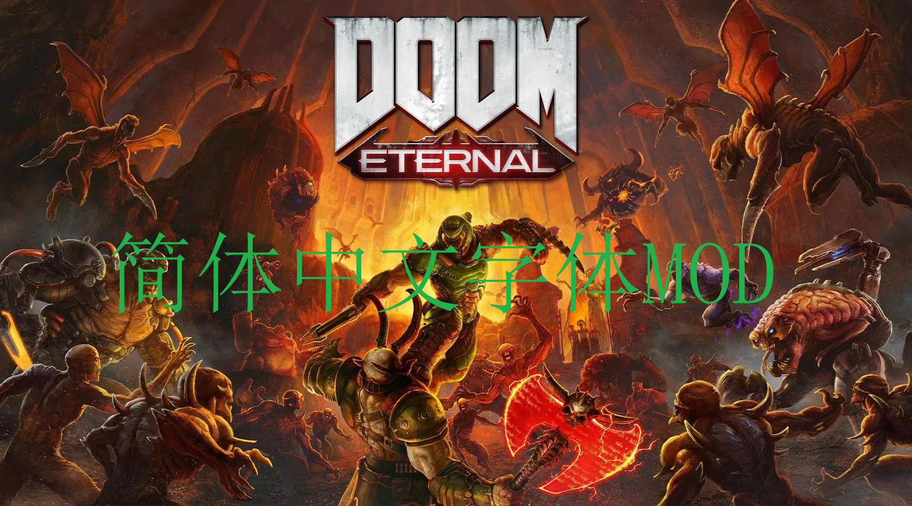
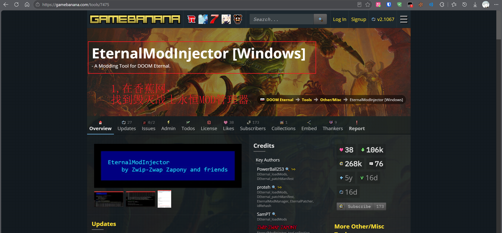
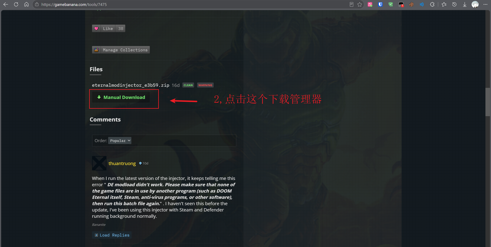
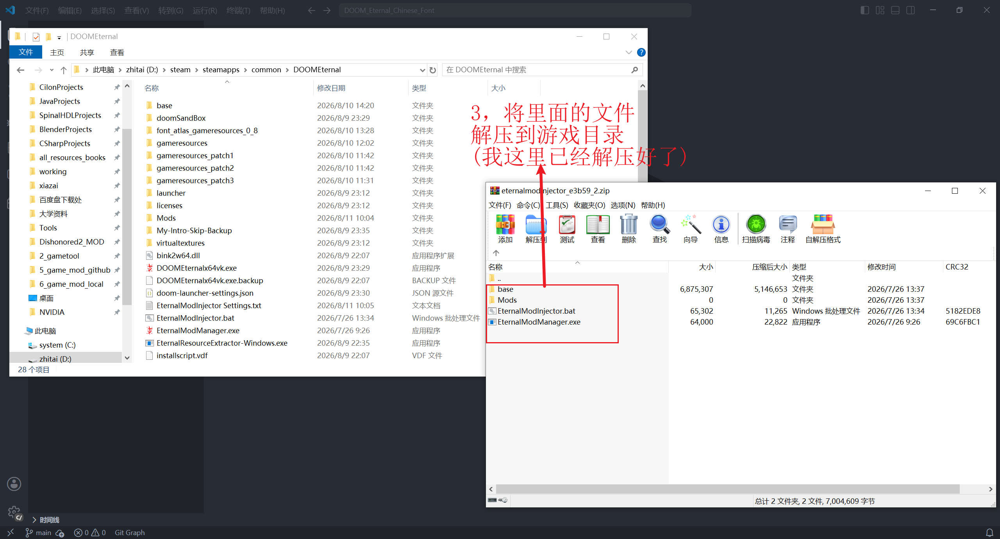
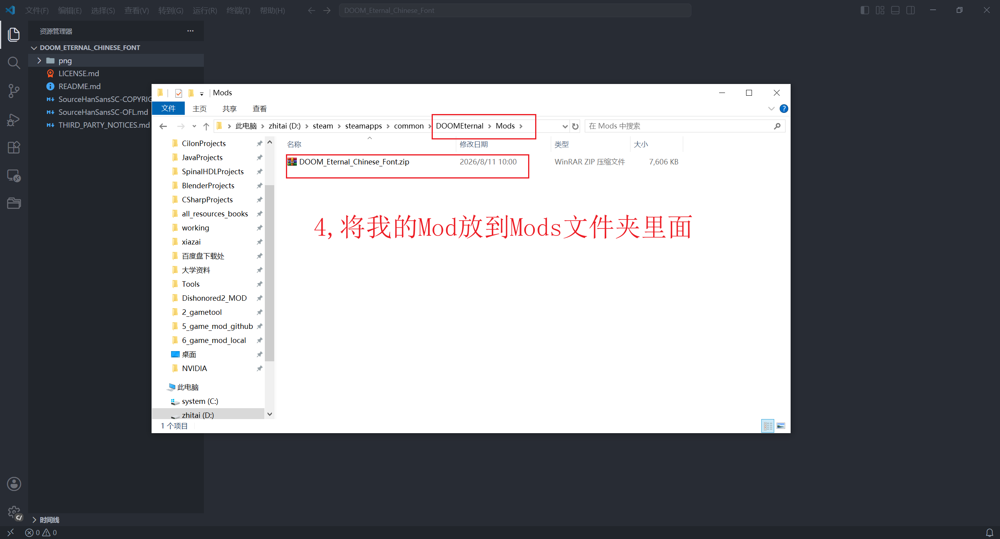
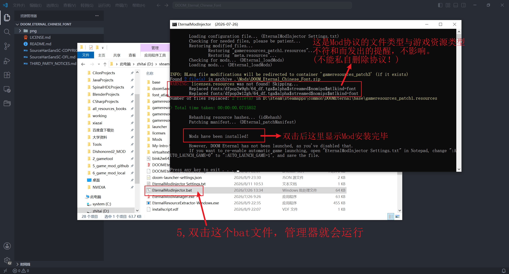
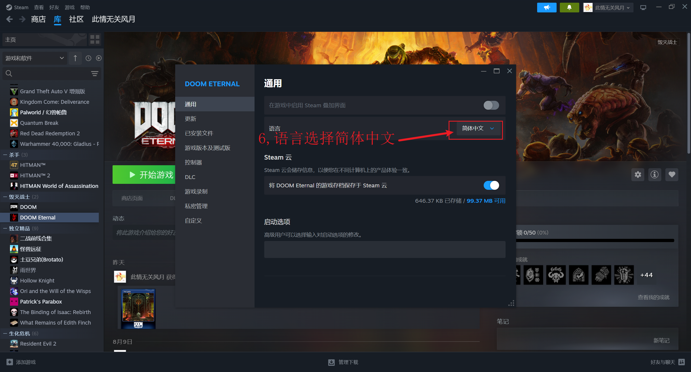

<div align="center">

# DOOM Eternal Chinese Font

### Simplified Chinese Font Replacement for DOOM Eternal

**使用 Source Han Sans SC / 思源黑体简体重建《DOOM Eternal》的简体中文与可安全替换普通文字字形。**



</div>

## Download / 下载

请前往本仓库的 [Releases](https://github.com/intergra/DOOM_Eternal_Chinese_Font/releases) 页面下载：

```text
DOOM_Eternal_Chinese_Font.zip
```

> [!IMPORTANT]
> 请下载 Release 页面中单独提供的 `DOOM_Eternal_Chinese_Font.zip`。GitHub 自动生成的
> `Source code (zip)` 和 `Source code (tar.gz)` 不是可安装的 Mod。

## Overview / 简介

本 Mod 用于改善《DOOM Eternal》原版简体中文字形轮廓不规则、笔画扭曲以及小字号
难以辨认的问题，并统一两套目标字体中可安全替换的普通文字外观。

简体中文粗体使用 **Source Han Sans SC Bold**，正文使用 **Source Han Sans SC Medium**。除简体中文外，替换范围还包括目标字体表中可安全替换的普通标点、拉丁字母与拉丁扩展、受支持的希腊文和西里尔文、通用标点与货币符号，以及全角和半角兼容文字。

本项目只修改现有字体图集中的目标字形像素，不修改游戏翻译文本、FontFX、SWF、DLL 或运行时代码。原有字体表、字符顺序、重复映射、排版度量、图集结构、资源名、语言映射和 fallback 行为均保持不变。

## Important Notes / 重要说明

1. 本 Mod 面向 Windows x64 Steam 版《DOOM Eternal》。
2. 安装需要 EternalModInjector 及其支持的 Mod Loader；本项目不包含或重新分发该工具。
3. 请把游戏语言设置为“简体中文”。本 Mod 使用游戏原有语言槽位，不会新增独立语言选项。
4. 不要同时安装其他会替换相同 `dfpop*` 字体图集的 Mod。
5. 请把 Mod ZIP 原样放入 `Mods` 文件夹，不要解压、改名或修改内部路径。
6. 使用任何 Mod 时都不要进入 Battlemode。
7. 本 Mod 不包含游戏本体；使用前必须拥有并安装通过合法渠道取得的游戏。

## Main Features / 主要内容

### 1. 简体中文粗体与正文字形

- `dfpop2w9gb` 粗体图集使用 Source Han Sans SC Bold；
- `dfpop3w12gb` 正文图集使用 Source Han Sans SC Medium；
- 只重建两套目标字体表中已经存在且可以安全替换的文字槽位；
- 改善复杂汉字、小字号正文和高对比界面中的笔画清晰度与整体一致性。

### 2. 普通文字风格统一

除简体中文外，本 Mod 还统一目标字体表中受支持的普通文字：

- 常用标点、数字与拉丁字母；
- 拉丁扩展字符；
- 字体表中已有且 Source Han Sans SC 覆盖的希腊文与西里尔文；
- 通用标点、货币符号和商标符号；
- 全角文字和半角兼容文字。

字体表中不存在的字符不会被凭空新增；Source Han Sans SC 未覆盖的字符继续保留原有显示与回退行为。

### 3. 保留游戏兼容结构

本 Mod 保留：

- 原字体数据文件、字符记录数量、顺序和重复映射；
- advance、bearing、baseline 与原有图集矩形；
- 图集尺寸、纹理格式、资源名和加载路径；
- 语言映射、FontFX 与 fallback 行为；
- 导航箭头、受保护的数学与游戏符号、按键图标；
- 控制字符、空白字符、替换字符、未分配记录和原空槽位。

## Package Contents / 文件内容

Release 页面提供的安装 ZIP 根目录包含：

```text
gameresources_patch1/
licenses/
```

两个可加载字体资源为：

```text
gameresources_patch1/fonts/dfpop2w9gb/64_df.tga$alpha$streamed$nomips$mtlkind=font
gameresources_patch1/fonts/dfpop3w12gb/64_df.tga$alpha$streamed$nomips$mtlkind=font
```

`licenses/` 包含：

```text
licenses/LICENSE.md
licenses/SourceHanSansSC-COPYRIGHT.md
licenses/SourceHanSansSC-OFL.md
licenses/THIRD_PARTY_NOTICES.md
```

EternalModInjector 只会把前述两个已识别路径作为游戏资源处理，并跳过 Markdown 许可
文件。详细日志中出现许可证路径被跳过的提示不代表安装失败。

## Recommended Environment / 推荐环境

- 操作系统：Windows x64
- 游戏：Steam 版《DOOM Eternal》
- Mod 工具：EternalModInjector 及兼容的 Mod Loader
- 游戏语言：简体中文
- 推荐安装前状态：未安装其他中文字体或相同 `dfpop*` 资源替换 Mod

## Prerequisite Tool / 前置工具

EternalModInjector 是独立第三方工具，不包含在本 Mod 中，也不属于本项目。游戏或
Injector 更新后，应重新确认当前工具版本与游戏资源的兼容性。

### 1. 找到 EternalModInjector

请前往 [GameBanana 的 EternalModInjector 页面](https://gamebanana.com/tools/7475)。



### 2. 下载 EternalModInjector

在页面的 Files 区域选择手动下载。



## Installation / 安装方法

安装前请关闭游戏，并从 `Mods` 文件夹移走其他会替换简体中文字体或相同 `dfpop*` 图集的 Mod。

### 3. 将 EternalModInjector 解压到游戏目录

解压下载的 EternalModInjector 压缩包，把其中的 `base`、`Mods`、`EternalModInjector.bat` 和管理器程序放到《DOOM Eternal》游戏根目录。不要在游戏
根目录中额外套一层管理器文件夹。



### 4. 将字体 Mod 放入 Mods 文件夹

把 `DOOM_Eternal_Chinese_Font.zip` 原样放入游戏根目录下的 `Mods` 文件夹，不要解压、
改名或修改 ZIP 内部路径。



### 5. 运行 EternalModInjector

双击游戏根目录中的 `EternalModInjector.bat`。正常日志应识别两个字体资源，并完成
`idRehash` 与 `DEternal_patchManifest`。



日志中出现类似下面的提示属于正常情况：

```text
WARNING: licenses.resources was not found! Skipping...
```

这是因为许可文件不是游戏资源。只要随后显示两个字体资源已替换，并出现 `Mods have been installed!`，即表示 Injector 已完成安装。

### 6. 将游戏语言设置为简体中文

在 Steam 中打开《DOOM Eternal》的“属性 → 通用”，将语言设置为“简体中文”。随后
启动游戏，检查菜单、设置、HUD 和正文显示。



## Updating / 更新方法

1. 关闭游戏。
2. 从 `Mods` 文件夹移走旧的 `DOOM_Eternal_Chinese_Font.zip`。
3. 放入新下载的同名 ZIP，不要解压或改名。
4. 重新运行 `EternalModInjector.bat`。
5. 启动游戏并检查字体显示。

不要同时保留多个改名副本，也不要在旧 ZIP 中手工覆盖文件。

## Uninstallation / 卸载方法

1. 关闭游戏。
2. 从 `Mods` 文件夹移走或删除 `DOOM_Eternal_Chinese_Font.zip`。
3. 重新运行 `EternalModInjector.bat`，让加载器根据当前 `Mods` 内容恢复资源。
4. 启动游戏并检查原版字体是否恢复。
5. 若仍有残留，请按照 Eternal Modding Wiki 的 Mod Removal 流程验证游戏文件并重置 Injector 备份。

不要只删除 Mod ZIP 后直接跳过 Injector；已经注入的资源需要由加载器重新处理。

## Known Notes / 已知说明

- 游戏语言菜单仍显示原有的“简体中文”，这是正常现象。
- Injector 日志显示两个字体资源被替换是预期结果。
- `licenses/` 中的 Markdown 被跳过不会影响字体资源安装。
- 本 Mod 不修改翻译内容；文字措辞仍来自游戏当前使用的简体中文本地化资源。
- 字体表未包含或 Source Han Sans SC 未覆盖的字符不会被强制替换。

## Credits / 制作信息

**作者：** NoWindNoMoon / 此情无关风月

**字体来源：** Source Han Sans SC / 思源黑体简体

本仓库采用[自定义权利与使用声明](LICENSE.md)。Source Han Sans SC 及由其生成的字体
衍生内容继续遵循 [SIL Open Font License 1.1](SourceHanSansSC-OFL.md)。详细版权、
来源和许可边界见 [SourceHanSansSC-COPYRIGHT.md](SourceHanSansSC-COPYRIGHT.md) 与
[第三方许可说明](THIRD_PARTY_NOTICES.md)。

游戏名称、原始文本、图像、音频和其他资产归其各自权利人所有。本项目是非官方、非商业的玩家制作 Mod，与 id Software、Bethesda Softworks、ZeniMax Media、Adobe 或其他相关权利人没有隶属、认可或赞助关系。使用本 Mod 必须拥有通过合法渠道取得的游戏副本。

## Support / 赞赏支持

如果这个项目对您有所帮助，欢迎自愿赞赏支持。您的每一份支持，都是我继续维护和
完善项目的动力。

<table>
  <tr>
    <td align="center" width="50%">
      <br>
      <strong>支付宝赞赏</strong>
    </td>
    <td align="center" width="50%">
      <br>
      <strong>微信赞赏</strong>
    </td>
  </tr>
</table>

## Feedback / 反馈

如果在游玩过程中发现缺字、方框、裁切、重叠、基线偏移、异常换行、字体资源冲突或
安装异常，请在本仓库的 [Issues](https://github.com/intergra/DOOM_Eternal_Chinese_Font/issues) 中反馈。

请尽量提供问题所在菜单、任务、字幕或 HUD 位置，原始分辨率截图、游戏语言、分辨率、UI 缩放、已安装 Mod 列表，以及 Injector 日志中与两个字体资源有关的部分。

感谢每一位测试和反馈问题的玩家。
